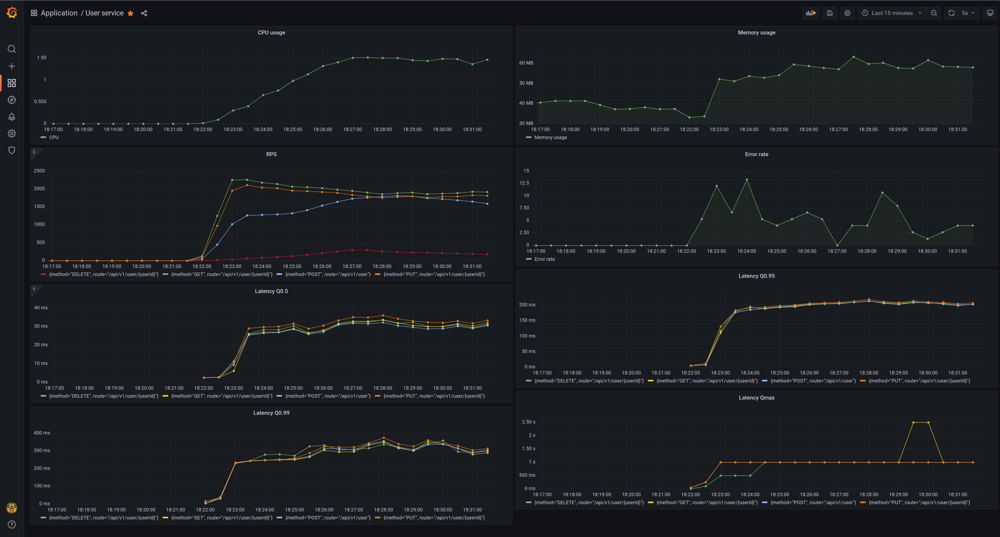
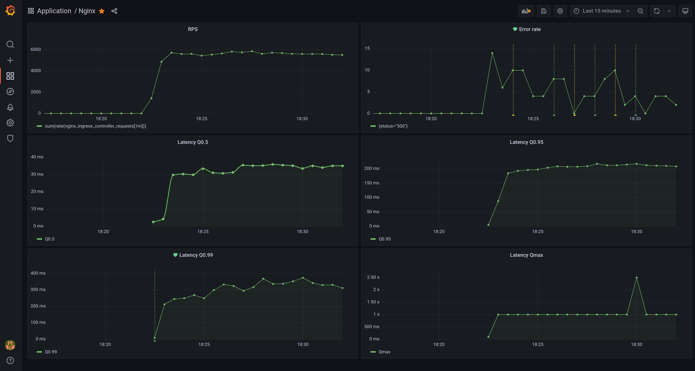
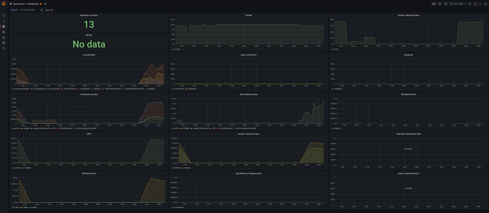

# Otus Microservice architecture Homework 3

## Домашнее задание выполнено для курса ["Microservice architecture"](https://otus.ru/lessons/microservice-architecture/)

### Настройка окружения

```shell
kubectl create namespace otus

# установка prometheus
helm repo add prometheus-community https://prometheus-community.github.io/helm-charts
helm repo add stable https://charts.helm.sh/stable
helm install prom prometheus-community/kube-prometheus-stack -f deployments/prometheus.yaml --atomic

# установка ingress nginx
helm repo add ingress-nginx https://kubernetes.github.io/ingress-nginx
helm install nginx ingress-nginx/ingress-nginx -f deployments/nginx-ingress.yaml --atomic
```

Запуск приложения

```shell
## запуск проекта
helm install --wait -f deployments/user-service-values.yaml user-service ./deployments/user-service --atomic
```

### Отладка

```shell
# отладка prometheus
kubectl port-forward service/prom-kube-prometheus-stack-prometheus 9090
# отладка graphana
kubectl port-forward service/prom-grafana 9000:80
# отладка postgres
kubectl port-forward svc/user-service-postgresql 5432:5432
```

### Тестирование

Нагрузочное тестирование с помощью [Grafana K6](https://k6.io).

```shell
k6 run test/k6/load-test.js
```

Тесты Postman расположены в директории `test/postman`. Запуск тестов.

```bash
newman run ./test/postman/test.postman_collection.json
```

Или с использованием Docker.

```bash
docker run -v $PWD/test/postman/:/etc/newman --network host -t postman/newman:alpine run test.postman_collection.json
```

## Примеры метрик в Grafana

### Метрики сервиса



### Метрики nginx



### Метрики postgres


